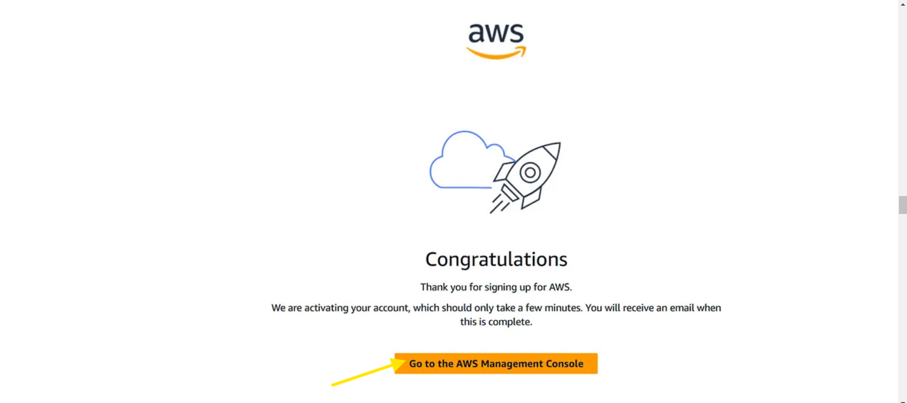

<!DOCTYPE html>
<html lang="en">
<head>
    <meta charset="UTF-8">
    <meta name="viewport" content="width=device-width, initial-scale=1.0">
    
</head>
<body>

<h1>AWS Account Creation Project</h1>

<h2>Project Duration: 2 hours</h2>

This mini project is designed to walk you through the process of creating an Amazon Web Services (AWS) account, providing step-by-step guidance and insights into the intricacies of setting up your AWS account. Before delving into the specifics of account creation, it's important to emphasize the fundamental principles of cloud computing, which serve as the foundation for this project. If you're new to the concept of "Cloud," it's recommended to familiarize yourself with cloud computing basics to fully grasp the significance of AWS account creation.

<h3>Project Goals and Learning Outcomes:</h3>
<ul>
    <li>Understand the basics of AWS Cloud and its importance for businesses and individuals.</li>
    <li>Successfully create an AWS account and navigate through the setup process.</li>
    <li>Learn how to access the AWS Management Console using newly created account credentials.</li>
    <li>Gain practical experience in using AWS services effectively for future projects or business needs.</li>
</ul>

<h3>What is Cloud?</h3>

You can imagine your computer or phone. It stores all your pictures, files, and apps, right? But what if you run out of space or lose your device? That's where the cloud comes in. The cloud is like a giant digital storage space, but it's not just one big hard drive sitting somewhere. It's actually made up of lots of powerful computers connected over the internet. These computers store and manage all your stuff securely.

It is like having a magical backpack that holds all your stuff, and you can access it whenever you need, no matter where you are.

So instead of keeping everything on your device, you can store it in the cloud. This means you can access your files, photos, and even apps from anywhere, as long as you have an internet connection.

<h3>What is AWS Cloud?</h3>

There are many cloud providers like Azure, Google Cloud Platform, and IBM Cloud, each offering a range of services for businesses and individuals. Amazon Web Services (AWS) is one of the leading cloud providers in the market, providing a comprehensive suite of cloud computing services.

It offers a vast array of computing resources, including servers, storage, databases, networking, and more, all delivered over the internet. It's like a huge digital world where companies and people can use really strong computers without having to invest in physical hardware.

<strong>Note</strong>: A cloud provider is a company that offers online storage and computing services. They let you store your data and run your apps on their powerful computers, which you can access over the internet.

<h3>Importance of AWS Cloud</h3>

The AWS Cloud is important because it lets businesses and individuals do things that were once only possible for big companies with lots of money. Now, even small businesses and startups can access the same powerful tools and technology to build, grow, and scale their ideas.

Example - If you're starting a new business, and you need a computer, some memory (RAM), storage space (like a hard disk), and a fast processor (CPU) to run your new app. But here's the tricky part: you're not sure if your business will take off, if lots of people will use your app, or if it'll just be a small project.

Instead of buying all those resources upfront, which could cost a ton of money, you can think of AWS like a big rental store for digital stuff. You only take what you need right now, and you pay for it as you use it. So if your app suddenly gets really popular and needs more resources, you can easily get them from AWS without breaking the bank. And if things slow down, you can scale back and pay less because it works on a Pay As You Go model.

<strong>Note</strong>: In the "pay as you go" model of AWS, you're charged for the services you use, like storing data or running a website. If you use more, you pay more; if you use less, you pay less. This way, you only pay for what you actually use, making it flexible and cost-effective for businesses.

<h3>Setting Up Your AWS Account</h3>
<ol>
    <li>Open the Create AWS account page.</li>
    <li>Click on Create an AWS account.</li>
    
    <li>Enter the valid required details like Email address, Password, and AWS account name. Then click verify email address.</li>
    
    <li>Check your respective email. You’ll receive a verification code there, copy that verification code.</li>
    
    <li>Now paste it here. Click on verify.</li>
    
    <li>Your Email address has been successfully registered. Now set Root user password. Then click on Continue.</li>
    
    <li>Now, the registration process will ask for your Personal Information. Enter all the Information and click on continue.</li>
    
    <li>As per your request, please provide your payment information for verification purposes. Rest assured, they will not charge you unless your usage surpasses the AWS Free Tier limits. Kindly note that some credit card or debit card companies may authorize a nominal charge of approximately USD $1.00 to validate the card's authenticity, with the charge typically being reversed shortly thereafter. Click on Verify and continue.</li>
    
    <li>Your payment process will be initiated. Please rest assured that your payment information will be securely processed.</li>
    
    <li>A One Time Password (OTP) will be sent to the respective phone number for verification purposes. Please ensure that you have access to the provided phone number to receive the OTP and complete the verification process.</li>
    
    <li>Then write this OTP here.</li>
    
    <li>To activate your account and confirm your identity. You have the option to choose either a Text message (SMS) or a Voice call to receive the verification code. Additionally, you will be presented with a CAPTCHA. Please enter the displayed code and proceed to send for verification.</li>
    
    <li>Please click on the 'Send' button to proceed. Once the verification process is initiated, the verification code will be sent to the respective phone number. Here, we have chosen to receive the verification code via Text message (SMS). Upon receiving the verification code, kindly copy it for further use in the verification process.</li>
    
    <li>Please fill in the verification code that you received. Then click on the 'Continue' button to proceed with the verification process.</li>
    
    <li>On the 'Select a support plan' page, please choose one of the available Support plans. Starting with the Basic support - Free option is recommended. Familiarize yourself with the details of each plan before making a selection. Once you've chosen the Basic support - Free plan, proceed by selecting 'Complete sign up' to finalize the process. Then choose complete sign up.</li>
    
    <li>Your Amazon Web Services account has been successfully created. Please click on 'Go to the AWS Management Console' to access your account.</li>
    
    <li>After completing the setup process, you can access the AWS Management Console using your new AWS account credentials. Now, Enter your Personalize Your Experience. Click Submit.</li>
    
    <li>Click Sign in to the Console.</li>
    
    <li>Select 'Root user' and enter your registered email address. Then click 'Next' to proceed.</li>
    
    <li>If a CAPTCHA is presented, please enter the displayed code and then click 'Submit' to proceed.</li>
    
    <li>Enter your root password. Click 'Sign In' to proceed.</li>
    
    <li>You have successfully logged in to your Amazon Web Services account.</li>
    
</ol>

<h3>Project Reflection</h3>

<ul>
    <li><strong>Understanding AWS Cloud</strong>: AWS Cloud provides a virtual space for storing digital content, making it easier to manage photos, videos, documents, and even create new apps or websites without worrying about storage limitations.</li>
    <li><strong>Importance of AWS Cloud</strong>: AWS Cloud levels the playing field for businesses, allowing even small startups to access powerful computing tools without huge upfront costs. It's like renting digital resources, paying only for what you use, which makes it flexible and cost-effective.</li>
    <li><strong>Setting Up AWS Account</strong>: The project walked through the process of creating an AWS account step by step, ensuring all necessary details were provided accurately, and a suitable support plan was chosen.</li>
    <li><strong>Accessing AWS Management Console</strong>: Once the account was set up successfully, users gained access to the AWS Management Console. From there, they could start using AWS services and resources to fulfill their needs.</li>
</ul>

</body>
</html>
